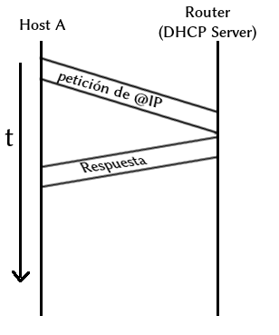

\onehalfspacing

# Conceptos básicos

**Host:**
    Un Host de red es una computadora u otro dispositivo conectado a una red de computadoras. Un host de red puede ofrecer recursos de informacion, servicios y aplicaciones a usuarios u otros nodos en la red. Un host de red es un nodo de la red al que se le asigna una _dirección de red_.

**Servidor:**
    Es un dispositivo que provee de funcionalidades a otros dispositivos dentro de la red.

**Router (ruteador):**
    Medio para transferir la información. (Máquinas que se utilizan para conectar las redes).

**Enlace:** Conexión entre el host y router.

**Dirección:** Número que utilizamos para identificar cada equipo dentro de la red.

Las direcciones que más nos van a interesar son:

* MAC
* IP
* Máscara de red

Una **dirección MAC** es un identificador de 48 bits. Está definida por el fabricante de la interfaz de red. Se le conoce también como _dirección física_.

Los 6 bytes que componen la dirección MAC son expresados con un número hexadecimal entre 0 y ff (0 y 255).

**Ejemplo:**  
3f:52:2a:1c:21:e6  
44:6d:57:6f:b1:ce

La **máscara de red** es una combinación de bits que sirve para delimitar el ámbito de una red de ordenadores. Su función es indicar a los dispositivos qué parte de la dirección IP es el número de la red, incluyendo la subred, y qué parte es la correspondiente al host.

\newpage

Por otro lado, la **dirección IP** es un número que identifica a una interfaz de red de manera lógica y jerárquica.

Está compuesta por 4 bytes separados entre sí por un punto. Cada byte está representado por un número entre 0 y 255. Con lo cual hay $2^{32}$ posibles direcciones IP.

**Ejemplos:**  
192.168.1.66  
192.168.0.2

Cada dirección IP está compuesta por *una parte de Red* y por una *parte de Host*. La parte de red es común en cada una de las máquinas que componen la red. Y la parte de Host es la parte que identificará a cada máquina dentro de la red.

## Direcciones reservadas

Clase	| Binario | Rango Decimal | Máscara de red
--- | :---: |:---: | ---
Clase A | 0xxxxxxx | 0 - 127 | 255.0.0.0
Clase B | 10xxxxxx | 128 - 191 | 255.255.0.0
Clase C | 110xxxxx | 192 - 223 | 255.255.255.0
Clase D | 1110xxxx | 224 - 239 | Multicast
Clase E | 1111xxxx | 240 - 255 | Reservada para uso futuro

Table: Clasificación de IP según primer byte.

**Protocolo:**
    Reglas que hay que seguir para que se dé la comunicación.

**DHCP (Dynamic Host Configuration Protocol. Protocolo Dinámico de Configuración de Host):**
    Es un protocolo que asigna direcciones IP a los hosts que se conectan al servidor DHCP.

\newpage

## Diagramas de tiempo

{ width=50% }

1. En $t_1$ el host A inicia la transmisión de la petición.
1. En $t_2$ el host A termina de transmitir la petición.
1. En $t_3$ el router empieza a recibir la petición.
1. En $t_4$ el router recibe completamente la petición.

