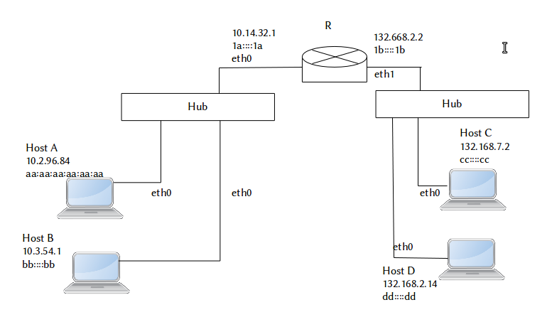

Un **hub** o **concentrador** es un dispositivo que canaliza el cableado de una red para ampliarla y repetir la misma señal a través de diferentes puertos. Básicamente, lo que hace es repetir la misma señal de un mismo paquete de datos a través de todos sus puertos.

Para que haya comunicación entre dos hosts, éstos deben de pertenecer a la misma red.

Los host de una misma red pueden comunicarse entre sí a través del Hub.

Una **tabla de ruteo** (también conocida como **tabla de encaminamiento**), es un documento electrónico que almacena las rutas a los diferentes nodos en una red informática. Los nodos en este caso son los host o hubs conectados en la red. Esta tabla es generada al momento de iniciar el sistema por el mismo Sistema operativo de cada host.

Cuando los datos se envían de un nodo a otro de la red, se hace referencia a la tabla de routeo.



En la figura 1 podemos ver un ejemplo en el que tenemos una red del lado derecho, y otra del lado izquierdo. Estas dos redes no podrían comunicarse entre sí si no estuvieran unidas por el router R.

Supongamos que queremos que el Host A haga un ping (se comunique) con el Host B.

Host A:
```
> ping 10.3.34.1
```

Debemos considerar la tabla de routeo del Host A, la cual está referida en el Cuadro 1:

 destination network | netmask | gateway | output interface
 :---: | :---: | :---: | :---:
 10.0.0.0 | 255.0.0.0 | (local) | eth0

Table: Tabla de routeo del host A

1. El host A toma la dirección destino netmask de la primera (y única en este caso) entrada en la tabla de routeo. Posteriormente realiza la operación AND con la netmask del Host B.

	IP destino: 10.3.34.1  
	Netmask HB: 255.0.0.0  
	IP destino AND netmask HB: 10.0.0.0

1. El host A concluye que el Host B está en la misma red de A.

1. El host A crea un paquete y lo envía por esa interfaz (eth0)

Supongamos que la red de la figura 1 no estuviera conectada con el router, y el Host A intentara enviarle un paquete al host C:

Host A:
```
> ping 132.168.7.2
```

1. El host A toma la dirección IP del host C y la compara con la máscara de red en la primera entrada.

	IP destino: 132.168.7.2 
	Netmask HB: 255.0.0.0  
	IP destino AND netmask HB: 132.0.0.0

2. El host A concluye que no coincide la 1ra entrada de la tabla de ruteo, y como no hay más entradas en esta tabla, el Host A concluye que no hay ruta para el Host C y no envía el paquete.

Al momento de unir dos redes distintas con un ruteador, como se ve en la Figura 1, podemos dar de alta en cada uno de los hosts una conexión con ese ruteador modificando la tabla de ruteo con el comando _route_ (en linux).

Por ejemplo, podríamos modificar la tabla de ruteo del Host A para que quedara de la siguiente manera:


destination network | netmask | gateway | output interface
:---: | :---: | :---: | :---:
10.0.0.0 | 255.0.0.0 | (local) | eth0
132.168.0.0 | 255.255.0.0 | 10.14.32.1 | eth0

Table: Nueva tabla de routeo del Host A.

Ahora, si Host A hace un ping hacia Host C:

> HA toma dirección IP de HC: 132.168.7.2  
> HA toma netmask segunda entrada: 255.255.0.0  
> IP Host C AND netmask: 132.168.0.0

Como si hay coincidencia con la segunda entrada de la tabla de ruteo, el Host A le envía un paquete al Gateway, para que éste se lo envíe al Host C.

Los host de una misma red tendrán las mismas tablas de ruteo.

destination network | netmask | gateway | output interface
:---: | :---: | :---: | :---:
132.168.0.0 | 255.255.0.0 | (local) | eth0
10.0.0.0 | 255.0.0.0 | 132.168.2.2 | eth0

Table: Tabla de ruteo del Host C

destination network | netmask | gateway | output interface
:---: | :---: | :---: | :---:
10.0.0.0 | 255.0.0.0 | (local) | eth0
132.168.0.0 | 255.255.0.0 | 10.14.32.1 | eth0

Table: Tabla de ruteo del Host B

destination network | netmask | gateway | output interface
:---: | :---: | :---: | :---:
132.168.0.0 | 255.255.0.0 | (local) | eth0
10.0.0.0 | 255.0.0.0 | 132.168.2.2 | eth0

Table: Tabla de ruteo del Host D

Por otro lado, tenemos la tabla de ruteo de R (el router):

destination network | netmask | gateway | output interface
:---: | :---: | :---: | :---:
10.0.0.0 | 255.0.0.0 | (local) | eth0
132.168.0.0 | 255.255.0.0 | (local) | eth1

A menos que se conecte a otro ruteador, R no requerirá ningún gateway.

El ruteador descongestiona una red local en varias subredes.
